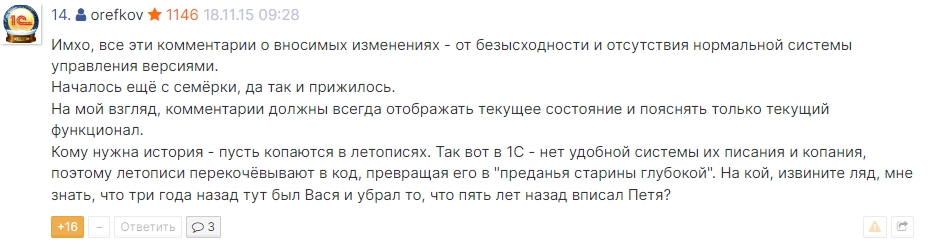

Статья должна дополняться, так как многие моменты ещё не учены.

  _Дисклеймер: если какие-то моменты странные - просба написать ишуз или отправить mr с исправлениями_
- [0. Система стандартов и методик разработки фирмы 1С](#0-система-стандартов-и-методик-разработки-фирмы-1с)
- [1. Обрамляющиeе комментарии](#1-обрамляющиeе-комментарии)
  - [1.1 Закомментированные блоки кода](#11-закомментированные-блоки-кода)
- [2. Сериализация ссылок для обмена через json](#2-сериализация-ссылок-для-обмена-через-json)
- [3. Префиксы в именах переменных](#3-префиксы-в-именах-переменных)
  - [3.1 Соглашение по стилю написания переменных и имен функций/методов](#31-соглашение-по-стилю-написания-переменных-и-имен-функцийметодов)
- [4. Проверка на пустой результат выполнения запроса](#4-проверка-на-пустой-результат-выполнения-запроса)
- [5. Правила перевода имен реквизитов 1с на латиницу в json](#5-правила-перевода-имен-реквизитов-1с-на-латиницу-в-json)
- [6. ПРАВИЛА РАБОТЫ С ТРАНЗАКЦИЯМИ](#6-правила-работы-с-транзакциями)
  - [6.2 Почему не рекомендуется передавать текст ошибки вместо непосредственной записи в ЖР](#62-почему-не-рекомендуется-передавать-текст-ошибки-вместо-непосредственной-записи-в-жр)
  - [6.3.1 Почему нужно использовать оператор ВызватьИсключение в блоке Исключение...КонецПопытки без параметра](#631-почему-нужно-использовать-оператор-вызватьисключение-в-блоке-исключениеконецпопытки-без-параметра)
  - [6.3.2 Почему не рекомендуется использовать ОписаниеОшибки()](#632-почему-не-рекомендуется-использовать-описаниеошибки)
  - [6.4 Почему нужно использовать блокировки при многопоточной загрузке данных](#64-почему-нужно-использовать-блокировки-при-многопоточной-загрузке-данных)
- [7. Необоснованное использование таймаута в тесте](#7-необоснованное-использование-таймаута-в-тесте)
- [8. Приведение к числу в попытке](#8-приведение-к-числу-в-попытке)
  - [8.2 Приведение числа к строке.](#82-приведение-числа-к-строке)
- [9. Замена вложенных условных операторов граничным оператором](#9-замена-вложенных-условных-операторов-граничным-оператором)
- [10. Чрезмерный уровень вложенности конструкций "Если"](#10-чрезмерный-уровень-вложенности-конструкций-если)
- [11. Сложные условия](#11-сложные-условия)
- [12. Смешивание контекстов условий фильтрации и объединения в запросах](#12-смешивание-контекстов-условий-фильтрации-и-объединения-в-запросах)
- [13. Экспортные процедуры/функции должны содержать описание](#13-экспортные-процедурыфункции-должны-содержать-описание)
  - [13.1. Скопированные из интернета куски кода должны содержать описание](#131-скопированные-из-интернета-куски-кода-должны-содержать-описание)
- [14. Бестолковые сообщения об ошибках: внести ясность](#14-бестолковые-сообщения-об-ошибках-внести-ясность)
- [15. Программное изменение текста запроса](#15-программное-изменение-текста-запроса)
  - [15.1 Не следует разбивать текст запроса на отдельные строки, ставящие крест на использовании конструктора.](#151-не-следует-разбивать-текст-запроса-на-отдельные-строки-ставящие-крест-на-использовании-конструктора)
  - [15.2 аналогично для имени таблицы](#152-аналогично-для-имени-таблицы)
  - [15.3 В случае если необходимо программно изменить условия запроса, лучше использовать замену выражения вида (1 = 1).](#153-в-случае-если-необходимо-программно-изменить-условия-запроса-лучше-использовать-замену-выражения-вида-1--1)
- [16. Как правильно размещать текст запроса в коде программы](#16-как-правильно-размещать-текст-запроса-в-коде-программы)
- [17. Ограничение на количество параметров метода](#17-ограничение-на-количество-параметров-метода)
- [18. Кто делает Code Review](#18-кто-делает-code-review)
- [19. Повторное использование переменных](#19-повторное-использование-переменных)

## 0. Система стандартов и методик разработки фирмы 1С
При разработке придерживаемся стандартов и методик разработки фирмы 1С: https://its.1c.ru/db/v8std

и диагностик протокола bsl: https://1c-syntax.github.io/bsl-language-server/diagnostics/

Проверка части стандартов автоматизирована в нашем статическом анализаторе http://sonar-server.rossko.local/

## 1. Обрамляющиeе комментарии
!Касается только разработки конфигураций на базе gitsync и edt! _(замечание @AleksandrShumakyan)_

Не рекомендуется использовать обрамляющие комментарии - со временем они усложняют чтение кода. Для отслеживания истории изменений есть git blame и плагины vscode: annotator и gitlens.

Также следует избегать комментариев, не дающих дополнительных пояснений о работе не-экспортной процедуры (функции).

* Не нужно использовать шаблоны текста для вставки своей подписи - данный подход вынужденно используется франчайзи и фрилансерами у которых нет гита
* Не нужно писать псевдонимы вида "КСИ" или "VVV"
* Не нужно вставлять открывающие и закрывающие символы вида "+++" и "---" или "{" и "}"
* Не нужно оставлять временную метку в часах минутах и секундах - всё это не несёт полезной информации
* Правильно: комментарий начинается с пробела, с большой буквы
* Если присутствует непреодолимое желание оставить свою подпись - это можно сделать в конце комментария - номер задачи, потом полные фамилия и имя. См. пример
 
 <details open>
  <summary>Примеры</summary>

  __Правильно__
  ```bsl
  # или комментарий без подписи
  
// Получает основной банковский счет даже без указания валюты.
// Если валюта не указана - выбираем первый подходящий банковский счет.
//
Функция ПолучитьОсновнойБанковскийСчет(Организация, Валюта = Неопределено) Экспорт
```
```bsl
# или подпись в конце комментария без даты
  
    // Контрагент и сумма для выгрузки по фитам #333478 Калеников Сергей
    ДанныеСтроки.Вставить("Sum" ,              Выборка.Сумма);
    ДанныеСтроки.Вставить("ClientInetShopID" , Выборка.IDКонтрагентИМ);
    ДанныеСтроки.Вставить("ClientFrontGUID" ,  XMLСтрока(Выборка.КонтрагентГУИД));
```
```bsl
# или вовсе без комментария
  
    ДанныеСтроки.Вставить("NDS" , Выборка.NDS);
    ДанныеСтроки.Вставить("GUIDOrder" , Строка(СтруктураШапкиДокумента.GUIDOrder));
    ДанныеСтроки.Вставить("GUIDOrganization" , Строка(СтруктураШапкиДокумента.GUIDOrganization));
  ```
  __Неправильно__
```bsl
// +++ VVV 19.10.2022: Получаем основной банковский счет даже без указания валюты
//      Если валюта не указана - выбираем первый подходящий банковский счет
Функция ПолучитьОсновнойБанковскийСчет(Организация, Валюта = Неопределено) Экспорт
```
```bsl
//kaiten #333478 +++ 2017-06-20 КИС добавляем контрагента и сумму для выгрузки по фитам.
ДанныеСтроки.Вставить("Sum" ,              Выборка.Сумма);
ДанныеСтроки.Вставить("ClientInetShopID" , Выборка.IDКонтрагентИМ);
ДанныеСтроки.Вставить("ClientFrontGUID" ,  XMLСтрока(Выборка.КонтрагентГУИД));
//kaiten #333478 ---
```
```bsl
// {Востриков Михаил карточка №476653 19.02.2018 17:56:23
ДанныеСтроки.Вставить("NDS" , Выборка.NDS);
ДанныеСтроки.Вставить("GUIDOrder" , Строка(СтруктураШапкиДокумента.GUIDOrder));
ДанныеСтроки.Вставить("GUIDOrganization" , Строка(СтруктураШапкиДокумента.GUIDOrganization));
//} Востриков Михаил 19.02.2018 17:56:23
```
Мнение эксперта:\

</details>

### 1.1 Закомментированные блоки кода

__Внимание:__ следует избегать закомментированных блоков старого кода. [Диагностика](https://1c-syntax.github.io/bsl-language-server/diagnostics/CommentedCode/)\
Если так хочется оставить старый код на всякий случай - используйте переключатель функциональности ([фичатогл](https://habr.com/ru/articles/464021/)).\
Наглядные изменения и так видны в дифе коммита гитлаба или гит-блейме гита.

## 2. Сериализация ссылок для обмена через json
При обмене данными через шину данных, например RabbitMQ, встречается задача сериализации структур данных в строку методом `ЗаписатьJSON`:
```bsl
СтруктураСообщения = Новый Структура;
// ... - заполнение структуры сообщения для передачи в другую систему

ЗаписьJSON = Новый ЗаписьJSON;
ЗаписьJSON.УстановитьСтроку();
ЗаписатьJSON(ЗаписьJSON, СтруктураСообщения);
СтрокаJSON = ЗаписьJSON.Закрыть();

Справочники.ИсходящиеСообщения.Опубликовать("goods.batch.negative.balance", СтрокаJSON); // отправка сообщения
```
Для того чтобы передать ссылку в строковом формате - необходимо получить её GUID (идентификатор).

Не нужно приводить ссылку к строке, получая идентификатор отдельным методом, для этого встроенный метод платформы `XMLСтрока()`

Неправильно
```bsl
СтруктураСообщения.Вставить("Partner", "" + ДанныеШапки.Партнер.УникальныйИдентификатор()); // неправильно
  
СтруктураСообщения.Вставить("УИДКонтрагента", Строка(Контрагент.УникальныйИдентификатор())); // неправильно
  
СтруктураСообщения.Вставить("GUID", XMLСтрока(ЗаказПокупателя.УникальныйИдентификатор())); // неправильно
```
```bsl
СтруктураСообщения.Вставить("ReasonCancellation", ""+ ?(ЗначениеЗаполнено(СтрокаОтправки.ПричинаОтмены), 
    СтрокаОтправки.ПричинаОтмены.УникальныйИдентификатор(), "00000000-0000-0000-0000-000000000000")); // не надо проверять пустую ссылку
```
Правильно
```bsl
СтруктураСообщения.Вставить("Partner", XMLСтрока(ДанныеШапки.Партнер)); // правильно
  
СтруктураСообщения.Вставить("УИДКонтрагента", XMLСтрока(Контрагент)); // правильно
```
```bsl
СтруктураСообщения.Вставить("ReasonCancellation", XMLСтрока(СтрокаОтправки.ПричинаОтмены));
// если ссылка пустая - метод XMLСтрока() и так вернет "00000000-0000-0000-0000-000000000000"
```
## 3. Префиксы в именах переменных
Венгерская нотация противоречит стандарту https://its.1c.ru/db/v8std#content:454:hdoc , использовать ее в проектах на УФ выглядит сомнительным решением.

Неправильно
```bsl
пТекущаяДата = ТекущаяДата();
 
ДанныеТЧТовары = Новый Структура("тчТоварыИтоги, тчТовары");
  
тзДанные = Новый ТаблицаЗначений;
```
Исключение: Конфигурации 7.7 и 8.1-8.2 (отраслевые), где не было УФ - это старые проекты которые писали клюшечники и для которых префиксы были необходимостью

### 3.1 Соглашение по стилю написания переменных и имен функций/методов

<ins>Неправильно:</ins>\
__Snake case:__ last_name, annual_earnings, total_snakes_found \
__Kebab case:__ "the-quick-brown-fox-jumps-over-the-lazy-dog"\
__lowerCamelCase:__ isConnected, thisIsAnExample, myXmlParser

<ins>Правильно:</ins>\
__UpperCamelCase__ (also known as PascalCase): UIInterfaceOrientationMask, SplashScreenState

В 1с общепринято использовать CamelCase нотацию, поэтому <ins>правильно:</ins> ВТДокументы или ВременнаяТаблицаДокументы, <ins>неправильно:</ins> ВТ_Документы, ВтДокументы, втДокументы или ВТ_ТЧ_НастройкиОбмена

<ins>Неправильно:</ins>  ```Процедура ДатаОтгрузки_НачалоВыбора(Элемент, СтандартнаяОбработка)```, \
<ins>Правильно:</ins> ```Процедура ДатаОтгрузкиНачалоВыбора(Элемент, СтандартнаяОбработка)```

Привила именования объектов метаданных: https://its.1c.ru/db/v8std/content/550/hdoc

## 4. Проверка на пустой результат выполнения запроса
Если требуется выбрать (или выгрузить) результат запроса, то предварительный вызов метода __Пустой__ не требуется

__Неправильно:__
```bsl
// 
Результат = Запрос.Выполнить();

Если НЕ РезультатПустой() Тогда
	Выборка = Результат.Выбрать();
	Выборка.Следующий();
	Если ЗначениеЗаполнено(Выборка.Подразделение) Тогда
		ВнутенннийЗаказ.Подразделение = Выборка.Подразделение;
	Иначе
		ВнутрениийЗаказ.Подразеление = БСП.ПолучитьЗначениеРеквизитаСправочника(ВнутреннийЗаказ.Филиал, "Подразделение");
	КонецЕсли;
Иначе
	ВнутреннийЗаказ.Подразделение = БСП.ПолучитьЗначениеРеквизитаСправочника(ВнутрениийЗаказ.Филиал, "Подразделение");
КонецЕсли;
```
__Правильно:__
```bsl
Результат = Запрос.Выполнить();
Выборка = Результатр.Выбрать();
Если Выборка.Следующий() Тогда
    ВнутреннийЗаказ.Подразделение = Выборка.Подразделение;
Иначе
    ВнутреннийЗаказ.Подразделение = БСП.ПолучитьЗначениеРеквизитаСправочника(ВнутреннийЗаказ.Филиал, "Подразделение");
КонецЕсли;
```
__Неправильно:__
```bsl
Результат = Запрос.Выполнить();
 
Если НЕ Результат.Пустой() Тогда
    Выборка = Результат.Выбрать();
    Пока Выборка.Следующий() Цикл
        СтрокиЗаказовПривилегированный.ОпубликоватьСтатусДоставкиЗаявкиНаВозвратОтПокупателя(Выборка.Пункт);
    КонецЦикла;
КонецЕсли; 
```
__Правильно:__
```bsl
Результат = Запрос.Выполнить();

Выборка = Результат.Выбрать();
Пока Выборка.Следующий() Цикл
    СтрокиЗаказовПривилегированный.ОпубликоватьСтатусДоставкиЗаявкиНаВозвратОтПокупателя(Выборка.Пункт);
КонецЦикла;
```

Об этом написано и в ИТС: https://its.1c.ru/db/v8std/content/438/hdoc

Диагностика: https://docs.checkbsl.org/checks/overall/WrongVerifyEmptyQueryResult/

## 5. Правила перевода имен реквизитов 1с на латиницу в json
Необходимо соблюдать общепринятые латинские названия реквизитов и не придумывать свои.

<ins>Неправильно:</ins> Kontragent, Nomenklatura, Summa

<ins>Правильно:</ins> Contractor, Goods, TotalSumm

__Именование основных повторяемых сущностей (формат сообщений)__
| Наименование реквизита | Наименование в JSON |
| -------- | ------- |
|Ссылка	| GUID |
|Код	| Code |
|Дата	| DateTime |
|Наименование	| Name |
|Родитель	| Parent |
|Пометка удаления	| DeletionMark |
|Номенклатура (массив)	| Goods |
|Контрагент	| Contractor |
|Филиал	| Branch |
|Склад	| Warehouse |
|ЦФО	| FRC |
|Валюта	| Currency |
|ЗаказПокупателя	| CustomerOrder |
|Чек	| Receipt |
|Партнер	| Partner |
|Проведен	| Posted |
|ТипДокумента	| DocumentType |
|ВидОперации	| OperationType |
|Справочник	| Catalog |
|Сотрудник	| Employee |
|Поставщик	| Supplier |

__Примеры__
```bsl
ДанныеСтроки = Новый Структура;
ДанныеСтроки.Вставить("GUID",                       XMLСтрока(Выборка.Ссылка));
ДанныеСтроки.Вставить("Number",                     СокрЛП(Выборка.Номер));
ДанныеСтроки.Вставить("DateTime",                   XMLСтрока(Выборка.Дата));
ДанныеСтроки.Вставить("DeletionMark",               Выборка.ПометкаУдаления);
ДанныеСтроки.Вставить("Posted",                     Выборка.Проведен);
ДанныеСтроки.Вставить("Presentation",               Строка(Выборка.Ссылка));
ДанныеСтроки.Вставить("DocumentType",               Выборка.Ссылка.Метаданные().Имя);
ДанныеСтроки.Вставить("DataVersion",                Выборка.ВерсияДанных);
//
ДанныеСтроки.Вставить("TotalSumm",                  Выборка.СуммаДокумента);
ДанныеСтроки.Вставить("DeliveryAddress",            XMLСтрока(Выборка.АдресДоставки));
ДанныеСтроки.Вставить("DeliveryAddressExtraData",   XMLСтрока(Выборка.ДополнениеКАдресуДоставки));
ДанныеСтроки.Вставить("ContractorGUID",             XMLСтрока(Выборка.Контрагент));
ДанныеСтроки.Вставить("ContractGUID",               XMLСтрока(Выборка.ДоговорКонтрагента));
ДанныеСтроки.Вставить("OrganizationGUID",           XMLСтрока(Выборка.Организация));   
ДанныеСтроки.Вставить("CurrencyGUID",               XMLСтрока(Выборка.ВалютаДокумента));
ДанныеСтроки.Вставить("AdjustedDocument",           XMLСтрока(Выборка.ИсправляемыйДокументРеализации));
ДанныеСтроки.Вставить("Goods",                      Выборка.Товары);
```
Для сериализации гуида используйте функцию `XMLСтрока()`
```bsl
СтруктураВСообщение.Вставить("Partner", "" + ДанныеШапки.Партнер.УникальныйИдентификатор()); // неправильно
  
СтруктураШапки.Вставить("УИДКонтрагента", Строка(Контрагент.УникальныйИдентификатор())); // неправильно
  
Структура.Вставить("GUID", XMLСтрока(ЗаказПокупателя.УникальныйИдентификатор())); // неправильно
  
Структура.Вставить("GUID", XMLСтрока(ЗаказПокупателя)); // правильно
```
## 6. ПРАВИЛА РАБОТЫ С ТРАНЗАКЦИЯМИ
__Общий шаблон транзакции__
```bsl
НачатьТранзакцию();
Попытка
    БлокировкаДанных = Новый БлокировкаДанных;
    ЭлементБлокировкиДанных = БлокировкаДанных.Добавить("Документ.ПриходнаяНакладная");
    ЭлементБлокировкиДанных.УстановитьЗначение("Ссылка", СсылкаДляОбработки);
    ЭлементБлокировкиДанных.Режим = РежимБлокировкиДанных.Исключительный;
    БлокировкаДанных.Заблокировать();
 
    // ... // чтение или запись данных
 
    ДокументОбъект.Записать();
 
    ЗафиксироватьТранзакцию();
Исключение
    ОтменитьТранзакцию();
 
    ЗаписьЖурналаРегистрации(НСтр("ru = 'Выполнение операции'"),
        УровеньЖурналаРегистрации.Ошибка,
        ,
        ,
        ПодробноеПредставлениеОшибки(ИнформацияОбОшибке()));
 
    ВызватьИсключение; // есть внешняя транзакция
 
КонецПопытки;
```
Основные правила:
1. Метод "НачатьТранзакцию" должен располагаться непосредственно перед оператором "Попытка"
2. Метод "ЗафиксироватьТранзакцию" должен идти последним в блоке "Попытка"
3. Метод "ОтменитьТранзакцию" должен идти первым в блоке "Исключение"
4. Необоснованное использование метода ТранзакцияАктивна()
5. При обработке исключений необходимо использовать метод ЗаписьЖурналаРегистрации()
6. Необходимо обязательно указывать 1, 2 и 5 параметр метода ЗаписьЖурналаРегистрации()
7. При получении текста ошибки в блоке исключения необходимо использовать ПодробноеПредставлениеОшибки()
8. Обращение к внешним ресурсам внутри транзакции вызывает проблемы производительности
9. Внутри транзакции недопустимо подавлять ошибки, вызывающие событие SDBL Func='setRollbackOnly'
10. При использовании вложенных транзакций в конце блока Исключение рекомендуется добавить оператор ВызватьИсключение
11. При использовании оператора ВызватьИсключение необходимо сохранять стек ошибок
12. Чтение данных в транзакции с их последующим изменением, необходимо производить после установки исключительной управляемой блокировки

Подробнее описано в статье: [Правила работы с транзакциями 1С](https://infostart.ru/1c/articles/1733411/)

### 6.2 Почему не рекомендуется передавать текст ошибки вместо непосредственной записи в ЖР
Не рекомендуется
```bsl
Исключение
    ОтменитьТранзакцию();
         
    СтруктураРезультат.Успех = Ложь;
    СтруктураРезультат.ОписаниеОшибки = ОписаниеОшибки();
 
    Возврат СтруктураРезультат;
         
КонецПопытки;
```
При переиспользовании такой функции другими разработчиками на запись в ЖР обычно забивают - неумышленно или по незнанию как правильно использовать - поэтому рекомендую писать текст ошибки в ЖР <ins>сразу</ins>.

### 6.3.1 Почему нужно использовать оператор ВызватьИсключение в блоке Исключение...КонецПопытки без параметра
Не следует передавать параметр при вызове исключения в блоке Исключение...КонецПопытки.

__Неправильно__
```bsl
Исключение
    ОтменитьТранзакцию();
    ИнформацияОбОшибке = ИнформацияОбОшибке();
    ЗаписьЖурналаРегистрации("Удаление файла в MinIO", УровеньЖурналаРегистрации.Ошибка, , ПрисоединенныйФайл, ПодробноеПредставлениеОшибки(ИнформацияОбОшибке));
    ВызватьИсключение КраткоеПредставлениеОшибки(ИнформацияОбОшибке); // <- неправильно, потерян стек
КонецПопытки;
```
Для этого следует вызывать оператор `ВызватьИсключение;` <ins>без параметров</ins>. Это позволяет сохранить стек ошибок и передать изначальное исключение в неизменённом виде. Подробнее смотри статью https://infostart.ru/1c/articles/1513676/

__Правильно__
```bsl
Исключение
    ОтменитьТранзакцию();
    ВызватьИсключение;
КонецПопытки;
```
*__При вызове оператора ВызватьИсклюение; не следует делать запись в журнал регистрации__*, так как это вызовет дублирование записей в журнале появятся 2 одинаковых записи. Неперехваченное исключение платформа сама делает запись в ЖР.

 
 <details open>
  <summary>Справка по оператору ВызватьИсключение (отрывок из встренной контекстной справки Ctrl+F1)</summary>

    ВызватьИсключение;

    Оператор позволяет вызвать исключение в тех случаях, когда несмотря на отработку исключительной ситуации операторами исключения необходимо прервать выполнение модуля с ошибкой времени выполнения. Оператор допустим только внутри операторных скобок `Исключение – КонецПопытки`.

    Выполнение данного оператора прекращает выполнение последовательности операторов исключения и производит поиск более "внешнего" обработчика исключения (при вложенных попытках). Если таковой есть, то управление передается на его первый оператор. Если нет, то исключительная ситуация обрабатывается системно, выдается сообщение о первоначально возникшей ошибке, а выполнение модуля прекращается
</details>

*__Исключение составляют случаи:__*
- когда исключение перехватывается на клиенте, где метод ЗаписьЖурналаРегистрации недоступен,
- или когда необходимо уточнить текст ошибки, дополнив его прикладной информацией
- или когда для подсистемы логируется имя события в ТЖ, типа "РаботаСФайлами.Удаление файла в MinIO".

Подробнее смотри: [IS: Шаблоны для применения cтандартов и методик разработки конфигураций 1С](http://infostart.ru/1c/tools/1864780/) и [ИТС: Перехват исключений в коде](https://its.1c.ru/db/v8std#content:499:hdoc)

### 6.3.2 Почему не рекомендуется использовать ОписаниеОшибки()
Не следует использовать функцию `ОписаниеОшибки`, т.к. она неинформативна для разработчика, потому что не возвращает стек в тексте ошибки.

__Неправильно__
```bsl
Исключение
    ЗаписьЖурналаРегистрации("Ошибка <ИмяАлгоритма>", УровеньЖурналаРегистрации.Ошибка, , , "Не удалось выполнить <ОписаниеОсобоВажнойПроцедуры> " + ОписаниеОшибки());
КонецПопытки;
```
Нельзя передавать ОписаниеОшибки() или КраткоеПредставлениеОшибки, теряется стек вызовов, нужно обязательно передавать ПодробноеПредставлениеОшибки. В стандарте 1С https://its.1c.ru/db/v8std/content/499/hdoc об этом написано.

Правильно записывать в журнал регистрации подробное представление исключения:

__Правильно__
```bsl
Исключение
    // Запись события в журнал регистрации для системного администратора.
    ЗаписьЖурналаРегистрации(НСтр("ru = 'Выполнение операции'"),
       УровеньЖурналаРегистрации.Ошибка,,,
       ПодробноеПредставлениеОшибки(ИнформацияОбОшибке()));
  КонецПопытки;
```
### 6.4 Почему нужно использовать блокировки при многопоточной загрузке данных
При наличии нескольких обработчиков(потоков) на загрузку объектов из очереди следует учитывать ситуацию когда два сообщения с одним и тем же объектом но с разной версией данных может начать обрабатываться двумя потоками одновременно. Это вызовет состояние гонки и второй, более медленный поток не сможет обработать сообщение из-за изменившихся данных объекта (см. [Оптимистическая блокировка](https://www.google.com/search?q=1с+оптимистическая+блокировка)).

Потоконебезопасный код
```bsl
Процедура Записать(Документ, Значение) Экспорт
     
    ДокументОбъект = Документ.ПолучитьОбъект(); // <- ошибка "нарушение целостности чтения объекта базы данных из-за параллельного изменения объекта другим сеансом"
    ДокументОбъект.Реквизит = Значение;
    ДокументОбъект.Записать(РежимЗаписиДокумента.Запись);
     
КонецПроцедуры
```
Избежать ошибки можно организовав очередь к документу наложив явную управляемую блокировку перед записью документа.

Потокобезопасный код
```bsl
Процедура ЗаписатьСБлокировкой(Документ, Значение) Экспорт
     
    НачатьТранзакцию();
     
    Попытка
         
        Блокировка = Новый БлокировкаДанных;
        ЭлементБлокировки = Блокировка.Добавить();
        ЭлементБлокировки.Область = "Документ.РеализацияТоваровУслуг";
        ЭлементБлокировки.УстановитьЗначение("Ссылка", Документ);
        Блокировка.Заблокировать();
         
        ДокументОбъект = Документ.ПолучитьОбъект();
        ДокументОбъект.Реквизит = Значение;
        ДокументОбъект.Записать(РежимЗаписиДокумента.Запись);
         
        ЗафиксироватьТранзакцию();
         
    Исключение
         
        ОтменитьТранзакцию();
        ВызватьИсключение;
         
    КонецПопытки;
     
КонецПроцедуры
```
При успешном наложении блокировки и 2 поток будет ожидать, пока не отработает 1

Подробнее в статье: [Разбор причины ошибки "Нарушение целостности чтения объекта базы данных из-за параллельного изменения объекта другим сеансом"](https://infostart.ru/1c/articles/1461438/)

## 7. Необоснованное использование таймаута в тесте

Для покрытия фонового задания тестом и ожидания его запуска многие используют шаг `Пауза`

Неправильно
```bsl
И ВызываюМетодРегламентногоЗадания "МодульАТН.АТН_Загрузка"
И Пауза 5
```
или самостоятельно реализуют паузу в своем шаге

Неправильно
```bsl
И Вызываю метод регламентного задания "РегламентныеЗадания.ОбработкаОчередиПоПотокам"
И я ожидаю появления записей в таблице "Справочник.ИсходящиеСообщения" "10" секунд
```
В случае если сервер bdd перегружен, таймаут ожидания запуска фоновых может быть превышен и это превращается в плавающий баг, фича становится мигающей.

Более того, эти паузы искусственно увеличивают время сборки.
 
<details open>
<summary>Правильно</summary>
Для избегания таймаутов рекомендуется использовать режим тестирования:

* вызывать методы фоновых напрямую 

    ```bsl
    Для Каждого Набор Из НаборыДанных Цикл
        Если Тестирование.ЭтоРежимАвтоматическогоТестирования() Тогда // под пользователем Jenkins выполняем методы интерактивно
            Выполнить(СтрШаблон("РегламентныеЗаданияВызовСервера.%1(Набор.Значение)", ИмяПроцедурыПотока));
            Продолжить;
        КонецЕсли;
    КонецЦикла;
    ```
* прокидывать дополнительный параметр АвтоТест
    ```bsl
    Функция ПроверитьНаСуществованиеВФНС(ДанныеКонтрагента, ЭтоТестБДД = Ложь) Экспорт
    Функция ВыполнитьБыструюПродажуПоСценарию(Сценарий=Неопределено,Автотест=Ложь) Экспорт
    ```
* использовать ДополнительныеПараметры объекта
    ```bsl
    Если ДополнительныеСвойства.Свойство("ЭтоАвтотест") Тогда
        Отказ = Истина;
        Возврат;
    КонецЕсли;
    ```
* использовать переключатель функциональности
    ```bsl
    Для Каждого Набор Из НаборыДанных Цикл
        
        // для атвотеста - не используем фоновое выполнение, а последовательный вызов процедуры
        Если ПереключателиФункциональности.Автотест() Тогда
            Выполнить("РегламентныеЗаданияВызовСервера." + ИмяПроцедурыПотока + "(Набор,Значение)");
        Иначе
            
            // запуск фонового
            // ...
    ```
</details>

## 8. Приведение к числу в попытке
Не рекомендуется использовать попытку для приведения к числу, так это вызывает ложные срабатывания при отладке с остановкой на ошибке.

Неправильно
```bsl
Попытка
    ТекЧисло = Число(ТекстовоеПоле);
Исключение
    ТекЧисло = 0;
КонецПопытки;
```
Это является нарушением стандарта разработки ИТС: https://its.1c.ru/db/v8std/content/499/hdoc п.3.8

Правильно
```bsl
ОписаниеТипа = Новый ОписаниеТипов("Число");
КоличествоДнейРазрешения = ОписаниеТипа.ПривестиЗначение(Значение);
```
### 8.2 Приведение числа к строке.

Правильно: `Формат(Число, "ЧГ=0")`. Неправильно: `СтрЗаменить(Строка(Число), Символы.НПП, "")`

## 9. Замена вложенных условных операторов граничным оператором
Выделите все проверки специальных или граничных случаев выполнения в отдельные условия и поместите их перед основными проверками. В идеале, вы должны получить «плоский» список операторов, идущих один за другим. Видео: https://www.youtube.com/shorts/xtmdJoYhGhI

* https://1c-syntax.github.io/bsl-language-server/diagnostics/TooManyReturns/ 
* [Почему ранний возврат из функций так важен?](https://habr.com/ru/post/348074/)
* Также известен как: [Replace Nested Conditional with Guard Clauses](https://refactoring.guru/ru/replace-nested-conditional-with-guard-clauses)

Общий принцип: чем меньше кода с двойным и более отступом - тем проще его читать.

Неправильно
```bsl
Процедура ДополнитьСтруктуруДаннымиГруппыСклада(Структура, Склад)
     
    Если ЗначениеЗаполнено(Склад) Тогда
         
        Запрос = Новый Запрос;
        Запрос.Текст =
        "ВЫБРАТЬ
        |   Склады.Родитель.Код КАК Код
        |ИЗ
        |   Справочник.Склады КАК Склады
        |ГДЕ
        |   Склады.Ссылка = &Склад";
         
        Запрос.УстановитьПараметр("Склад", Склад);
         
        РезультатЗапроса = Запрос.Выполнить();
         
        ВыборкаДетальныеЗаписи = РезультатЗапроса.Выбрать();
        ВыборкаДетальныеЗаписи.Следующий();
        Структура.Вставить("WarehouseGroupCode", СокрЛП(ВыборкаДетальныеЗаписи.Код));
    Иначе
        Структура.Вставить("WarehouseGroupCode", "");
    КонецЕсли;
     
КонецПроцедуры
```
Правильно - использовать приём "Ранний возврат"
```bsl
Процедура ДополнитьСтруктуруДаннымиГруппыСклада(Структура, Склад)
     
    Если НЕ ЗначениеЗаполнено(Склад) Тогда
        Структура.Вставить("WarehouseGroupCode", "");
        Возврат;
    КонецЕсли;
     
    Запрос = Новый Запрос;
    Запрос.Текст =
    "ВЫБРАТЬ
    |   Склады.Родитель.Код КАК Код
    |ИЗ
    |   Справочник.Склады КАК Склады
    |ГДЕ
    |   Склады.Ссылка = &Склад";
     
    Запрос.УстановитьПараметр("Склад", Склад);
     
    РезультатЗапроса = Запрос.Выполнить();
     
    ВыборкаДетальныеЗаписи = РезультатЗапроса.Выбрать();
    ВыборкаДетальныеЗаписи.Следующий();
    Структура.Вставить("WarehouseGroupCode", СокрЛП(ВыборкаДетальныеЗаписи.Код));
     
КонецПроцедуры
```

## 10. Чрезмерный уровень вложенности конструкций "Если"
Количество вложенных конструкций "Если", "Для", "Пока" и "Попытка" не должно превышать 4

Диагностика: http://sonar-server.rossko.local/coding_rules?open=bsl%3ANestedControlFlowDepth&rule_key=bsl%3ANestedControlFlowDepth

Чрезмерно вложенные конструкции  Если ,  Для ,  Пока  и  Попытка  затрудняют чтение и понимание кода. Повышение читаемости кода в свою очередь ведет к уменьшению допускаемых при разработке ошибок и повышает качество прикладного решения.

Также известен как: [Flattening Arrow Code](https://blog.codinghorror.com/flattening-arrow-code/)

Неправильно
```bsl
Если Чтото Тогда                     // Допустимо - уровень = 1
    /* ... */
    Если ЧтоТоЕще Тогда              // Допустимо - уровень = 2
        /* ... */
        Для Ном = 0 По 10 Цикл       // Допустимо - уровень = 3
            /* ... */
            Если ОпятьУсловие Тогда  // Уровень = 4, лимит достигнут, но не превышен
                Попытка              // Уровень = 5, Превышен лимит
                    /* ... */
                Исключение
                КонецПопытки;
                Возврат;
            КонецЕсли;
        КонецЦикла;
    КонецЕсли;
КонецЕсли;
```
Источник: https://docs.checkbsl.org/checks/overall/NestedControlFlowDepth/

Чтобы избавиться от "гребенки" советуют следующие [приёмы рефакторинга](https://softwareengineering.stackexchange.com/questions/47789/how-would-you-refactor-nested-if-statements): 

1. __Place Guard Conditions at the Start__, так же этот приём известер под названием ["Ранний возврат"](https://www.youtube.com/shorts/Yz2NuqMnWS8)
   Все возможные проверки следует выносить в начало метода:
    ```bsl
    Если (!Check#1)
        Возврат;
    CodeBlock#1
    
    Если (!Check#2)
        Возврат;
    CodeBlock#2
    ```
    _todo: добавить пример на языке 1С_

    Подробнее смотри: https://refactoring.com/catalog/replaceNestedConditionalWithGuardClauses.html

2. __Decompose Conditional__ blocks into seperate functions или __Extract into a function__, так же известный как "Извлечение метода"

    Когда код состоит из сложного условного оператора (если-то-иначе), обычно следует применить рефакторинг. Одним из решений является разложение сложных частей условия на отдельные методы: if, then и else. Извлеките условный код в методы с говорящими именами, чтобы облегчаете жизнь человеку который будет поддерживать код позже.

    _todo: перевести и вставить статью https://qafoo.com/blog/098_extract_method.html_

3. __Remove Logic for Controlling the Iteration__, или "Вынос контролирующей логики из цикла"
    Отфильтруйте ненужные элементы коллекции (в запросе или методе) заранее, используюя функциональный подход вместо императивного ("map/filter/reduce", LINQ)
    ```bsl
    ФильтрованнаяКоллекция = ФильтроватьЭлементыПоУсловиюБизнесЛогики(Коллекция);
    МодифицированнаяКоллекция = ВыполнитьПредварительныеПреобразования(ФильтрованнаяКоллекция);
    // далее наш цикл без вложенных условий
    // ...
    ```
    _todo: добавить более наглядный пример до и после_

4. __Evaluate complex conditions into a single boolean__, или "Объединение условий в логические переменные"

    См. пункт "11. Сложные условия"

    

5. __Избегать обратных условий__

    Считаю, всеми силами надо избегать обратных условий. При невозможности обойтись - искать синонимы.

    Неправильно, имя переменной не должно начинаться с отрицания
    ```
    Если НетОшибок Тогда
    ```
    Например надо добавить параметр учетной политики "НеИспользоватьФункционал". Кажется, что его удобнее задать именно так, т.к. по умолчанию будет Ложь, и не надо перезаполнять документы. Но потом начинается кошмар в коде... `Если НЕ НеИспользоватьФукнционал() Тогда`

    Лучше либо описать прямо: ИспользоватьФункционал, и добавить обработчик обновления, который взведет флаг в Истина в существующих документах (учетных политик не так много, на самом деле). Либо найти синоним, например "ИсключитьИспользованиеФункционала".

    Иначе при дальнейшем развитии и усложнении кода начинаются игры разума с "НЕ НетОшибок". И вместо того чтобы работать приходится маяться такой фигней, соображать что будет при расчете.

    Источник: https://infostart.ru/1c/articles/1670466/

## 11. Сложные условия
"Тяжелые" многострочные условия затрудняют понимание кода.

Подозрительный код
```bsl
Если Тип = "Структура"
    ИЛИ Тип = "Строка"
    ИЛИ Тип = "Число" Тогда
  КакойТоКод();
КонецЕсли;
```
Плохо читаемые или сложные условия нужно выделять в переменные или методы.

Исправленный код
```bsl
ЭтоПодходящийТип = ПодходящийТип(Тип);
Если ЭтоПодходящийТип Тогда
    КакойТоКод();
КонецЕсли;
 
Функция ПодходящийТип(Тип)
  ЭтоПодходящийТип = "Структура"
    ИЛИ Тип = "Строка"
    ИЛИ Тип = "Число"
  Возврат ЭтоПодходящийТип;
КонецФункции
```

Источник: https://docs.checkbsl.org/checks/overall/BulkyConditions/


Подробнее смотри: https://refactoring.com/catalog/decomposeConditional.html 

## 12. Смешивание контекстов условий фильтрации и объединения в запросах
Не нужно писать условия фильтрации в секции ON и не нужно писать условия соединения в секции WHERE

Сравните читаемость двух вариантов
```bsl
-- вариант 1 (правильно)
SELECT *
LEFT JOIN linkedin
ON facebook.name = linkedin.name
WHERE facebook.city = 'SF'
-- вариант 2 (неправильно)
SELECT *
FROM facebook
LEFT JOIN linkedin
ON facebook.name = linkedin.name AND facebook.city = 'SF'
```
Keep the context separate between joining the tables and filtering the joined table. It is the most readable, least likely to be inaccurate, and should not be less performant.
* JOIN data in ON
* Filter data in WHERE
* Write explicit JOINs to make your Query more readable
* Filter data in the WHERE clause instead of the JOIN to ensure it is correct and readable
* Different SQL languages may have different query plans based on filtering in the ON clause vs the WHERE clause, so test the performance on your database

Подробнее смотри: 
* https://dataschool.com/how-to-teach-people-sql/difference-between-where-and-on-in-sql/
* https://stackoverflow.com/questions/354070/sql-join-where-clause-vs-on-clause

## 13. Экспортные процедуры/функции должны содержать описание
Обязательного комментирования требуют процедуры и функции входящие в  [программный интерфейс модулей](https://its.1c.ru/db/v8std/content/455/hdoc)  - такие процедуры и функции предназначены для использования в других функциональных подсистемах (или в других приложениях), за которые могут отвечать другие разработчики, поэтому они должны быть хорошо документированы. 

[ИТС: Описание процедур и функций](https://its.1c.ru/db/v8std#content:453:hdoc)

Для вставки шаблона комментария в конфигураторе используем контекстное меню Текст → Рефакторинг → Создать описание процедуры

Внимание! Если это обработчик регламентного задания - то первой строчкой в комментарии должно идти описание к какому регзаданию процедура принадлежит.

В описании спользуйте имя метаданного, а не синоним. Пример:

Правильный комментарий метода регзадания
```bsl
// Обработчик регламентного задания ПривязкаПлатежейИРеализаций
//
// Формирует задания на привязку платежей и реализаций за последний месяц,
// разбивает контрагентов по порциям,
// сохраняет в регистр истории и отправляет в очередь RMQ для последующей обработки
//
Процедура ПривязкаПлатежейИРеализаций(НачПериода, КонПериода, Очистка = Ложь) Экспорт
```
Как правильно писать комментарии описано в диагностике:  https://docs.checkbsl.org/checks/overall/UndocumentedPublicApi/

Документация по типизации таблиц значений, списков, массивов и структур в комментариях: [v8-code-style: Типизация кода](https://github.com/1C-Company/v8-code-style/blob/master/docs/checks/code_typification.md)

<details>
<summary>Документирующие типизирующие комментарии, примеры для основных типов</summary>

Объект
```bsl
// Описание метода
// 
// Параметры:
//  Объект - СправочникОбъект.Товары, ДокументОбъект.РеализацияТоваров - Здесь описание для списка типов
Процедура ОбработкаОбъекта(Объект)
```

Ссылка
```bsl
// Возвращаемое значение:
// Структура:
// * Ссылка - СправочникСсылка.Номенклатура - ссылка на текущую номенклутру
// ...
Функция НовыйСложныйОбъектДанных()
    Данные = Новый Структура;
    Данные.Вставить("Ссылка", ...);
    ...
    Возврат Данные;
КонецФункции
```
Массив
```bsl
// Параметры:
//  Объект - Массив из СправочникОбъект.Товары - Здесь единственный тип элементов
Процедура ОбработкаОбъекта(Объект)
```
Структура
```bsl
// Возвращаемое значение:
// Структура:
// * Ссылка - СправочникСсылка.Номенклатура - ссылка на текущую номенклутру
// ...
Функция НовыйСложныйОбъектДанных()
    Данные = Новый Структура;
    Данные.Вставить("Ссылка", ...);
    ...
    Возврат Данные;
КонецФункции
```
Структура сложная
```bsl
// Параметры:
//  Объект - Структура - Здесь нельзя многострочное описание:
//  * ПолеСтруктруы - ТаблицаЗначений - Описание поля структуры, после опять раширение уже для таблицы:
//    ** ИмяКолонки - Число - описание колонки таблицы
Процедура ОбработкаОбъекта(Объект)
```
Таблица значений
```bsl
// Возвращаемое значение:
// ТаблицаЗначений:
//  * Номенклатура - СправочникСсылка.Номенклатура
//  * Характеристика - СправочникСсылка.ХарактеристикиНоменклатуры
//  * Склад - СправочникСсылка.Склады
//  * Количество - Число
// ...
Функция ТоварыДляСписания()
....
    Возврат Таблица;
КонецФункции
```
Строка таблицы или дерева значений
```bsl
// Параметры:
// СтрокаТаблицы - СтрокаТаблицыЗначений:
//  * Номенклатура - СправочникСсылка.Номенклатура
Процедура ОбработкаТаблицы(СтрокаТаблицы)
    СтрокаТаблицы.Номенклатура = Справочники.Номенклатура.ПустаяСсылка();
```
Соответствие
```bsl
// Возвращаемое значение:
// Соответствие из КлючИЗначение:
// * Ключ - Строка
// * Значение - Массив из ДокументОбъект
Функция НовоеСоответствие()
   ...
```
Список значений
```bsl
// Функция-конструктор нового пустого объекта даннных
//
// Возвращаемое значение:
// СписокЗначений из ДокументОбъект:
Функция НовыйСписокДокументов()
   Возврат Новый СписокЗначений;
КонецФункции
```
Дерево значений
```bsl
// Параметры:
// ...
//
// Возвращаемое значение:
// ДеревоЗначений:
//  * Наименование - Строка
//  * ВидЭлемента - ...
//  * ...
Функция ДеревоНовыхЭлементов(Форма, ИмяЭлементаДерева)
    Возврат Форма.РеквизитФормыВЗначение(ИмяЭлементаДерева);
КонецФункции
```
Выборка из результат запроса
```bsl
// Возвращаемое значение:
// ВыборкаИзРезультатаЗапроса:
//  * Номенклатура - СправочникСсылка.Номенклатура
Функция ОстаткиДляОбработки()
    Запрос = Новый Запрос;
    Запрос.Текст = 
        ТексЗапросаОстатков()
        + ТекстЗапросаРезервов();
    РезультаЗапроса = Запрос.Выполнить();
    Возврат РезультатЗапроса.Выбрать();
КонецФункции;
```
 </details>

### 13.1. Скопированные из интернета куски кода должны содержать описание 
В случае если из интернета копируется процедура/функция - копировать не только метод, но и так же описание метода и, желательно, ссылку на источник.

Если код универсальный - желательно помещать его в общий модуль для переиспользования.

## 14. Бестолковые сообщения об ошибках: внести ясность
Зачастую Разработчики оставляют в коде технические сообщения, а иногда и просто ленятся написать хорошее информативное описание ошибки.

Пример неинформативного сообщения об ошибке
```bsl
Процедура ПередЗаписью(Отказ, РежимЗаписи, РежимПроведения)
    // ...
    АдресаИмИзТочкиДоставки = ПолучитьАдресаИмИзТочкиДоставки();
         
    Если АдресаИмИзТочкиДоставки.Количество() > 0 Тогда
             
        ТекстОшибки = "Запрещено создавать в ручную новую заявку на возврат с видом доставки отличного
            |от Самовывоз и не заполненным реквизитом <Адрес доставки ИМ>.";
        ДопМодуль.СообщитьПользователю(ТекстОшибки);
        Отказ = Истина;
```
При написании текста ошибки оцените его по шкале информативности, 5 основных правил:


Используйте активный, а не пассивный залог. Побуждайте к действию, а не запрещайте.

Идеальное сообщение об ошибке - это его отсутствие, поэтому если есть возможность - исправляйте ошибки автоматически.

В данном случае в ходе код-ревью была выявлена возможность подставлять <Адрес доставки ИМ> из документа-основания.

Ещё один пример:

В сообщение требуется внести какой сейчас статус, и какой нужен
```bsl
Процедура ОбработкаПроведения(Отказ, РежимПроведения)
    Если НЕ СхемаОптимизацииЛогистикиПартеррыСервер.ЗаказИмеетКорректныйСтатусПоСхемеОЛП(Ссылка) Тогда
        ВызватьИсключение("Заказ клиента имеет некорректный статус для движения по схеме ОЛП");
    КонецЕсли;
```
В данном случае используется вызов исключения вместо установки параметра Отказ. При [коридорном тестировании](https://www.google.com/search?q=коридорное+тестирование) неосведомленный человек будет поставлен в тупик "некорректным" статусом.

todo: [Отказ или ВызватьИсключение?](https://www.google.com/search?q=mista+отказ+вызватьисключение) - расписать

Источник: https://habr.com/ru/post/645551/

## 15. Программное изменение текста запроса
### 15.1 Не следует разбивать текст запроса на отдельные строки, ставящие крест на использовании конструктора.
Неправильно
```bsl
ТекстЗапроса =
"ВЫБРАТЬ
| Номенклатура.Наименование  КАК Наименование ,
| Номенклатура. " + ИмяПоляКод + " КАК КодАртикул
|ИЗ
| Справочник.Номенклатура КАК Номенклатура";
```
Лучше использовать для этого параметр:

Правильно
```bsl
ТекстЗапроса =
"ВЫБРАТЬ
| Номенклатура.Наименование  КАК Наименование,
| &ИмяПоляКод  КАК КодАртикул
|ИЗ
| Справочник.Номенклатура КАК Номенклатура";
ТекстЗапроса = СтрЗаменить(ТекстЗапроса, "&ИмяПоляКод", "Номенклатура." + ИмяПоляКод);
```
### 15.2 аналогично для имени таблицы

Правильно
```bsl
ТекстЗапроса =
"ВЫБРАТЬ
| ТаблицаСправочника.Наименование КАК Наименование,
| ТаблицаСправочника.Код КАК Код
|ИЗ
| #ТаблицаСправочника КАК ТаблицаСправочника";
ТекстЗапроса = СтрЗаменить(ТекстЗапроса, "#ТаблицаСправочника", "Справочник." + ИмяСправочника); // или "&ТаблицаСправочника"
```
### 15.3 В случае если необходимо программно изменить условия запроса, лучше использовать замену выражения вида (1 = 1).

правильно
```bsl
|ИЗ
|   ВТ_ПредварительныеДанные КАК ВТ_ПредварительныеДанные
|       ЛЕВОЕ СОЕДИНЕНИЕ РегистрСведений.ЦеныНоменклатуры КАК ЦеныНоменклатуры
|       ПО ВТ_ПредварительныеДанные.ТипЦен = ЦеныНоменклатуры.ТипЦен
|           И ВТ_ПредварительныеДанные.Номенклатура = ЦеныНоменклатуры.Номенклатура
|           И ВТ_ПредварительныеДанные.Период = ЦеныНоменклатуры.Период
|           И (1 = 1)
|ГДЕ
|   ЦеныНоменклатуры.Регистратор ЕСТЬ NULL";
Запрос.УстановитьПараметр("Таблица",Данные.Таблица);
Если ЗначениеЗаполнено(пДокСсылка) Тогда
    Запрос.Текст = СтрЗаменить(Запрос.Текст, "1 = 1","ЦеныНоменклатуры.Регистратор <> &ТекущаяСсылка");
    Запрос.УстановитьПараметр("ТекущаяСсылка",пДокСсылка);
КонецЕсли;
```
или вариант 2 (хуже)
```bsl
Запрос.Текст =
    "ВЫБРАТЬ
    |   ПотребностьВНоменклатуреОстатки.ПредЗаказПоставщику КАК ПредЗаказПоставщику,
    |   ПотребностьВНоменклатуреОстатки.ПредЗаказПоставщику.Получатель КАК Получатель,
    |   ПотребностьВНоменклатуреОстатки.ПредЗаказПоставщику.Ответственный КАК Менеджер,
    |   ПотребностьВНоменклатуреОстатки.ПредЗаказПоставщику.Получатель.ОсновнойЦФО КАК ПолучательЦФО
    |ПОМЕСТИТЬ ВТДокументы
    |ИЗ
    |   РегистрНакопления.утз_ПотребностьВНоменклатуре.Остатки(
    |           &ТекущаяДата,
    |           ИСТИНА
    |               И &УсловиеПолучатель) КАК ПотребностьВНоменклатуреОстатки";
     
Если ЗначениеЗаполнено(ПолучательОтбор) Тогда
    Запрос.Текст = СтрЗаменить(Запрос.Текст, "&УсловиеПолучатель", "ПредЗаказПоставщику.Получатель = &Получатель");
Иначе
    Запрос.УстановитьПараметр("УсловиеПолучатель", Истина);
КонецЕсли;
```

15.4 В случае если необходимо собирать запрос по частям, допускается разделение на блоки, не вызывающие ошибки конструктора.

Пример
```bsl
Разделитель =
    "
    |;
    |/////////////////////////////////////////////////////////////
    |";
 
ТекстыЗапросовПакета = Новый Массив;
 
ТекстЗапроса =
    "ВЫБРАТЬ
    | Упаковки.Ссылка КАК Ссылка
    |ИЗ
    | Справочник.Упаковки КАК Упаковки";
 
ТекстыЗапросовПакета.Добавить(ТекстЗапроса);
 
ТекстЗапроса =
    "ВЫБРАТЬ
    | Номенклатура.Ссылка КАК Ссылка
    |ИЗ
    | Справочник.Номенклатура КАК Номенклатура";
ТекстыЗапросовПакета.Добавить(ТекстЗапроса);
ТекстЗапроса = СтрСоединить(ТекстыЗапросовПакета, Разделитель);
```
или так:
```bsl
Запрос = Новый Запрос;
Запрос.Текст = "ВЫБРАТЬ
|   ТаблицаДанных.Ссылка КАК Ссылка
|ПОМЕСТИТЬ ВТДляОбработки
|ИЗ
|   &ОбновляемыеДанные КАК ТаблицаДанных
|
|ИНДЕКСИРОВАТЬ ПО
|   Ссылка
|
|"
+ ОбъектыРасчетовСервер.ТекстПроверкаИспользованияВРасчетныхРегистрах(Истина, Истина)
+ ОбъектыРасчетовСервер.ТекстПроверкаИспользованияВТабличныхЧастях(Истина, Истина)
+ ТекстЗапросаДоговораСДвижениямиПоДочернимПартнерам(Истина)
+ "
|;
|
|////////////////////////////////////////////////////////////////////////////////
|ВЫБРАТЬ
|   ИспользованиеВРасчетныхРегистрах.ОбъектРасчетов КАК ОбъектРасчетов
|ПОМЕСТИТЬ ВТТребуетсяГеренация
|ИЗ ВТИспользованиеВРасчетныхРегистрах КАК ИспользованиеВРасчетныхРегистрах
```

Источник: https://its.1c.ru/db/v8std/content/437/hdoc п. 6.2

## 16. Как правильно размещать текст запроса в коде программы
Неправильно
```bsl
Текст  = "ВЫБРАТЬ РАЗРЕШЕННЫЕ
         |  ЕСТЬNULL(Пункты.Маршрут.НомерМаршрута, """") КАК НомерМаршрутногоЛиста,
         |  ЕСТЬNULL(Пункты.Маршрут.Дата, """") КАК ДатаМаршрута,
         |  ВЫБОР
```
Текст запроса нужно размещать на следующей строке после оператора, кавычка должна быть расположена на том же уровне, что и начало оператора на прошлой строке.

Только в таком случае не портится конструктором запроса размещение запроса в коде и форматирование кода Alt+Shift+F так же не изменяет положение запроса. Т.е. два этих редактора только в таком случае согласованы между собой.

Правильно
```bsl
ЗапросПакет.Текст =
"ВЫБРАТЬ
|	ПартииТоваровНаСкладах.Номенклатура КАК Item,
|	ПартииТоваровНаСкладах.Склад КАК Warehouse,
|	ПартииТоваровНаСкладах.Склад.Филиал КАК Unit,
|	ЕстьNULL(ПРЕДСТАВЛЕНИЕ(ТИПЗНАЧЕНИЯ(ПартииТоваровНаСкладах.ДокументОприходования)), """") КАК ReceiptDocumentType,
|	ЕСТЬNULL(ПартииТоваровНаСкладах.ДокументОприходования.Номер, """") КАК ReceiptDocumentNumber,
```
Так же, для выразительности, короткий текст запроса можно выделить табуляцией, как это делает "Конструктор запроса с обработкой результата...":

Правильно
```bsl
Запрос = Новый Запрос;
Запрос.Текст = 
    "ВЫБРАТЬ
    |	Банки.Ссылка КАК Ссылка
    |ИЗ
    |	Справочник.Банки КАК Банки";

РезультатЗапроса = Запрос.Выполнить();
```
Источник: https://programmist1c.ru/st_programming/st_kak_pravilno_razmest_text_v_zapros.html

## 17. Ограничение на количество параметров метода
Максимальное количество параметров - 7: 
https://1c-syntax.github.io/bsl-language-server/diagnostics/NumberOfParams/

Максимальное количество необязательных параметров - 3: 
https://1c-syntax.github.io/bsl-language-server/diagnostics/NumberOfOptionalParams/

Рекомендуется группировать однотипные параметры в один или несколько составных параметров типа Структура: 
[ИТС: Параметры процедур и функций](https://its.1c.ru/db/v8std#content:640:hdoc), п. 5

## 18. Кто делает Code Review
По-хорошему нужно делать так, что каждый из команды ревьюит разработчика который сделал Merge Request. Но иногда встречается, что над любым разработчиком есть ментор/наставник и именно он ревьюит разработчика. Первый подход считаю более правильным, так как чем больше людей ревьюит код, тем лучше для проекта и для команды. Здесь сразу затрагиваются такие аспекты, как командное взаимодействие, коллективная ответственность, увеличение bus-фактора.

## 19. Повторное использование переменных
Использование одной переменной для разных целей - это неправильно. Во-первых, вы, я вас уверяю, скорее всего не столкнетесь с такой ситуацией, когда лишние 4 байта (или сколько ваш компилятор будет задействовать для хранения int'a) могут сыграть большую роль. (более того, я могу вам гарантировать, что будет миллион случаев, где вы успешно потратите впустую куда большие объемы памяти и даже не обратите на это внимание)

Во-вторых, (и в главных) такая экономия ни к чему хорошему не приведет - переменная должна использоваться только для одной цели, использовать ее в нескольких целях чревато серьезными проблемами. Скорее всего, если вы будете применять эту порочную практику в сколько-нибудь больших проектах, вы однажды просто используете "старое" значение переменной в "новых" целях просто из-за невнимательности, а это может привести к самым непредсказуемым последствиям. 

Источники:
* https://ru.stackoverflow.com/questions/202362/Повторное-использование-переменных
* [Code Smell 107 - Variables Reuse](https://dev.to/mcsee/code-smell-107-variables-reuse-3m53)

